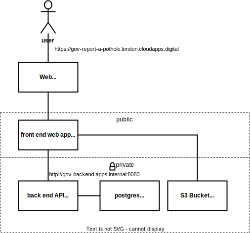

# Pothole app - a three tier demo app

This is a simple demo app that can be deployed to cloud foundry and elsewhere

architecture



- front end app in ruby/sinatra
  - public app with route from the internet
  - uses an S3 backing service to store photos of potholes
  - makes use of a private API service
- back end API service in ruby/sinatra
  - private app that is not internet facing
  - uses postgres backing service to store report data 


## installing on GOV.UK PaaS

`git clone https://github.com/alphagov/paas-com`

`cd department-examples/gov/3tier/`

`cf login --sso`

`cf target -o ORG_NAME -s SPACE_NAME`

`cf create-service aws-s3-bucket default gov-pothole-imgs`

`cf create-service postgres tiny-unencrypted-13  backend-postgres`

```
(
  cd backend
  cf7 push
)

(
  cd frontend
  cf7 push
)

(
  cf add-network-policy gov-frontend --destination-app gov-backend
)

```

## installing on ECS Fargate using AWS Copilot

the application architecure is as before but the runtime is different

- targets AWS ECS
- workloads run on fargate
- requires an aws account
- front end is a load balanced web service
- back end is a private service
- uses service discovery  


`copilot app init`

`copilot env init`

`copilot env deploy`

`copilot svc init`

`copilot svc deploy`

`copilot svc init`

`copilot svc deploy`

`copilot storage`

`copilot storage`


