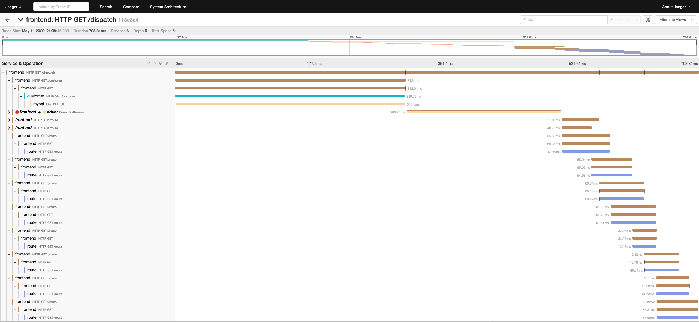

# Jaeger

[Jaeger](https://www.jaegertracing.io/) is a distributed tracing and analysis server.

## Demo
The `demo.yml` manifest will deploy a `jaeger-all-in-one` instance using an in-memory database
as well as an example application called [HotROD](https://medium.com/opentracing/take-opentracing-for-a-hotrod-ride-f6e3141f7941)
> Note: This is for demonstration purposes only. Using an in memory database means traces will not be persisted for very long



## Persistent
The `persistent.yml` manifest will deploy a `jaeger-all-in-one` instance using Elasticsearch as a persistent backing store.

## Requirements

- Elasticsearch - `jaeger-elasticsearch` (persistent deployment only)

## Setup

## Download Jaeger binaries

There is a script to download and extract the Jaeger binaries to the correct locations.

From the `jaeger` directory, run:
```bash
./fetch-jaeger-binaries.sh
```

## Push the apps
All commands are using the `cf` CLI version 7 or higher.

### Demo
```
$ cf push --strategy rolling -f demo.yml jaeger-all-in-one --var deployment=my-deployment-name
$ cf push --strategy rolling -f demo.yml jaeger-example-app --var deployment=my-deployment-name
```

#### Allow the applications to communicate with one another

```
$ cf add-network-policy jaeger-example-app \
    --destination-app jaeger-all-in-one \
    --port 6831 --protocol udp
```

### Persistent
```
$ cf push --strategy rolling -f persistent.yml jaeger-all-in-one --var deployment=my-deployment-name
```


## Authentication

This deployment puts Jaeger unauthenticated on the public internet, this
is probably not desirable.

You should configure Jaeger to:

- either be behind an authentication proxy
- or only be accessible internally

## Deployment

Either `v3-zdt-push` or `cf push --strategy=rolling` using the CF CLI version 7
should be used, in order for the applications to keep their meshing and network
policies intact.
